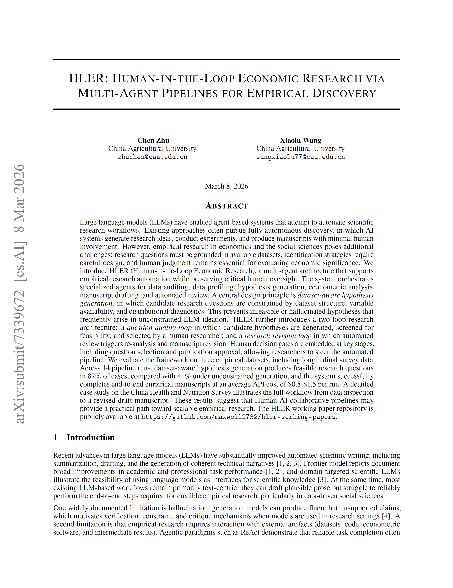
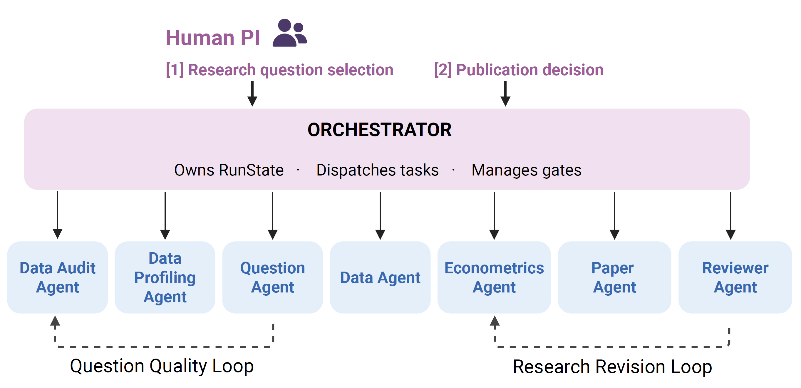

# Human-in-the-Loop Economic Research (HLER) Lab  
# 人机协作-经济学研究实验室

*An ongoing experiment in preserving human judgment in the age of vibe research.*  
*在Vibe Research的自动化科研时代，强调人类判断权的一次持续实验。*

**Preprint is now online (2026/03/11):** https://doi.org/10.48550/arXiv.2603.07444

<table>
<tr>
<td>

</td>
</tr>
</table>

---

## About the Lab ｜ 实验室简介

The **Human-in-the-Loop Economic Research (HLER) Lab** explores how scientific research should evolve when computational execution becomes automated, created by **Chen Zhu (China Agricultural University) 朱晨 | 遗传社科研究** (https://zhuchencau.wordpress.com/)

Rather than pursuing fully autonomous research pipelines, the Lab designs structured human-AI/Agent collaboration systems in which execution may be automated, but judgment remains human.

因此，**HLER 不是一个“全自动写论文机器”。**  它是一项关于科研结构的长期方法论实验。

在该框架下：

- AI/Agent负责结构化执行（数据处理、计量估计、图表生成、初稿撰写）
- 人类研究者保留关键判断权（问题选择、识别策略确认、模型审核、发表决定）

> Execution may be automated. Judgment must remain human.  
> 执行可以自动化，判断必须属于人。

---

## Working Paper Series ｜ 工作论文系列

This repository hosts the **Human-in-the-Loop Economic Research Working Papers**.

Each paper is labeled:

**Human-in-the-Loop Economic Research Working Papers No. XXX** (*hler_wp_XXX.pdf*)

编号按照时间顺序递增，代表系统的迭代轨迹。

These papers are methodological prototypes.  
They are iterative, revisable, and open to critique.

本系列更强调科研结构的探索。

**2026/03/08更新**：增加 R script（从hler_wp_019开始）

**2026/03/21更新**：第一次试用 Doubao Seed 2.0 Pro API （hler_wp_028），bugs need to be fixed

---
## Pipeline Overview of the HLER Framework｜ HLER研究流程结构

<table>
<tr>
<td>

</td>
</tr>
</table>

### Core Stages ｜ 核心阶段

| Stage | Description |
|-------|------------|
| **DATA_AUDIT** | Audits available datasets before question formulation |
| **QUESTIONING** | Generates candidate research directions; human selects |
| **DATA_COLLECTION** | Activates relevant dataset; prevents cross-domain mixing |
| **ANALYSIS** | Produces regressions, summary statistics, visualizations |
| **WRITING** | Generates structured manuscript draft |
| **REVIEW** | Evaluates novelty, identification, clarity, and policy relevance |
| **FINAL APPROVAL** | Publication requires explicit human confirmation |

整个流程强调：
- 数据隔离（Dataset isolation）
- 决策节点可追溯（Auditable human gates）
- 责任明确（Clear authorship accountability）

---

## Research Scope ｜ 研究方向

The Lab engages with research in:

- Labor Economics  
- Health and Human Capital  
- Agricultural and Development Economics  
- Behavioral Economics  
- Genoeconomics and Biological Heterogeneity  

研究主题涵盖劳动、健康、农业、行为经济学及遗传经济学等领域。

---

## Current Stage ｜ 当前阶段说明

This series is in an early methodological phase.

Some working papers may appear technically simple or stylistically preliminary. This reflects the iterative nature of the system. Both the workflow and research outputs will evolve over time.

本系列目前处于方法探索阶段。部分论文在理论深度或写作风格上可能仍显初步。这是系统演进的一部分。

We invite readers to evaluate not only the findings, but also the structure of the research process itself.

我们更希望读者关注的是科研协作结构本身。

---

## What This Repository Is ｜ 本仓库的边界

This repository contains working papers only.  
The underlying research system is not included.

本仓库仅发布工作论文。

---

## Author ｜ 作者

**Chen Zhu 朱晨** ｜ China Agricultural University 中国农业大学

Special thanks to Dr. Xiaolu Wang 感谢王晓璐博士的特别支持

---

## Contact ｜ 联系方式

For academic collaboration or discussion, please contact via institutional email: zhuchen@cau.edu.cn

学术交流与合作欢迎通过机构邮箱联系：zhuchen@cau.edu.cn

